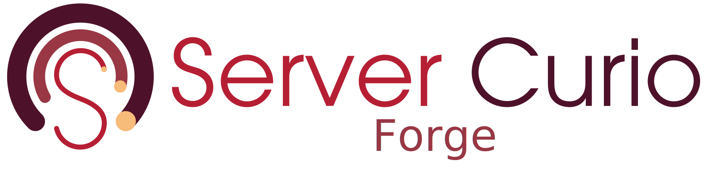

<p align="center">
  
</p>

# forge

Project documentation, design, and the website for the Server Curio project family — the
[`go-echo-starter`](https://github.com/servercurio/go-echo-starter),
[`go-cli-starter`](https://github.com/servercurio/go-cli-starter), and
[`go-library-starter`](https://github.com/servercurio/go-library-starter) templates and related
work.

This repository is intentionally minimal. It currently holds only the configuration and meta files
that every Server Curio repository shares; the [Hugo](https://gohugo.io) site is built on top of
this foundation.

## Contents

- `CLAUDE.md` + `.claude/` — guidance for AI agents working in the repository
- `.github/workflows/` — CI; PR-title formatting checks
- `.github/CODEOWNERS` — review routing
- `.gitignore` — Hugo / Node / editor / OS ignore rules
- `docs/logo.svg` — canonical brand mark
- `LICENSE` — Apache License 2.0

## Getting started

The site is built with the **extended** edition of [Hugo](https://gohugo.io). Once site content
exists:

```sh
hugo server -D      # local dev server with drafts at http://localhost:1313
hugo --gc --minify  # production build into public/ (gitignored)
```

See [`.claude/build-commands.md`](.claude/build-commands.md) for the full command reference and
[`.claude/module-structure.md`](.claude/module-structure.md) for the intended layout.

## Contributing

Commits must be **GPG-signed** and carry a **DCO `Signed-off-by:`** trailer; a per-clone
`prepare-commit-msg` hook appends the trailer automatically (see
[`.claude/git-hooks.md`](.claude/git-hooks.md)). Pull-request titles follow the conventional-commit
grammar and are validated in CI.

## License

Licensed under the [Apache License 2.0](LICENSE).
