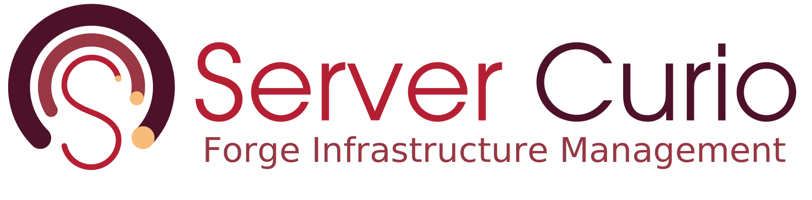

<p align="center">
  
</p>

# forge

Project documentation, design assets, and the website for the Server Curio project.

This repository is intentionally minimal. It currently holds only the configuration and meta files
that every Server Curio repository shares; the [Hugo](https://gohugo.io) site is built on top of
this foundation.

## Contents

- `CLAUDE.md` + `.claude/` — guidance for AI agents working in the repository
- `CONTRIBUTING.md` — contribution, commit-signing, and pull-request guide
- `SECURITY.md` — vulnerability reporting policy
- `CODE_OF_CONDUCT.md` — community standards
- `.github/workflows/` — CI; PR-title formatting checks
- `.github/CODEOWNERS` — review routing
- `.gitignore` — Hugo / Node / editor / OS ignore rules
- `docs/design/` — design documents and RFCs (numeric-prefix series)
- `docs/images/logo.svg` — canonical brand mark
- `LICENSE` — Apache License 2.0

## Getting started

The site is built with the **extended** edition of [Hugo](https://gohugo.io). Once site content
exists:

```sh
hugo server -D      # local dev server with drafts at http://localhost:1313
hugo --gc --minify  # production build into public/ (gitignored)
```

See [`.claude/build-commands.md`](.claude/build-commands.md) for the full command reference and
[`.claude/module-structure.md`](.claude/module-structure.md) for the intended layout.

## Contributing

See [`CONTRIBUTING.md`](CONTRIBUTING.md) for local setup, the required commit-signing (GPG + DCO)
and git-hook steps, and the pull-request workflow. Participation is governed by our
[Code of Conduct](CODE_OF_CONDUCT.md).

To report a vulnerability, follow the private process in [`SECURITY.md`](SECURITY.md) — please don't
open a public issue.

## License

Licensed under the [Apache License 2.0](LICENSE).
